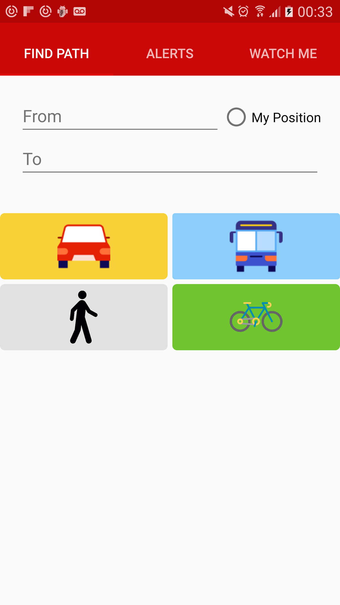

# GoDetroit

## Description

The intent of this application is to aid the denizens of Detroit by offering them realtime updates and directions while travelling. Our mission is to help a user get from Point A to Point B as quickly as possible while also offering them information about the relative risk and/or safety at any given time. 

On first launch this selection view is shown: 

On this screen a user is prompted to enter her query parameters. The user can either manually enter a start destination, or choose his/her current location. After adding her desired destination they can then choose her optimal means of transporation. In order of presentation (from left to right, top to bottom) the user can choose to take private transit (i.e. a car), take public transportation (i.e. a bus), to walk, or to cycle. The path information is sourced from Google and then queried against our API where we make decisions about how to guide the user and/or adjust her route.

Detail View:

When on a route, the user will be able to see the detail view which presents the user with the map embed of her directions, as well as her relative danger. The application determines the danger of the user on the route by taking data submitted from within the application (provided by other users) and running it through a multi-stage machine learning algorithm that involves a great deal of natural langugae processing to determine the sentiment and meaning of each comment. This dervived data is then used to present the user with her "Danger According to PPL" rating, and the individual data pieces are presented below, where a user can signify the value by upvoting or downvoting and thus have an influence on their respective weight in future uses in our model.

Important to note is that if the user is not currently on a route, they can also still select the Alerts tab from the main view and be presented with the following:

The alerts are run through a process similar to that described above, with the greatest difference being that now the alerts shown are those which are closest in location to the user rather than those on his/her route.

Lastly, is the Watch Me tab which allows the user to share his/her location with others so that her movements, as well as safety/danger ratings, can be watched in real time. The intended use of this application is to allow for someone (possible a loved one) to track a users movements and rest assured that they know how the user is doing.

## API
### POST

- `/api/feedback`
	- Expects to recieve `JSON` in the form: `{'text': 'Something that you wanted the server to parse'}` and will return the output of this text run through the FeedBack NLP algorithm.

- `/publish: {lat, lon, alert}`
    - Publish an alert at the specified position

- `/get: {lat, lon}`
    - Fetch the alerts nearby the specified (lat,lon) location

- `/score: {id}`
    - Thumbs up to the alert with specified id

- `/danger: {lat, lon, type}`
    - type = "a", "p"
    - Returns the danger according to authorities (type == a) or to people (type == p) next to the specified lat,lon location